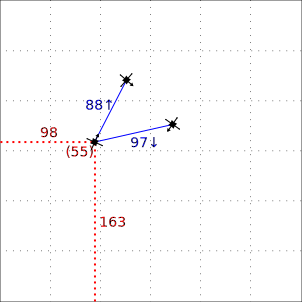

GUI Screen Concepts
===================

(["Online" version](https://luchs.ara.uberspace.de/pse/graphics/gui%20screen%20concepts/README.html) as SVGs aren't
rendered on github)

Some ideas of what the big white space in the middle of our [current GUI concept](http://i.imgur.com/RUPRziy.png) might
look like. Note that there will usually be lot more space available than the 300x300px shown here. Try your browser's
zoom function to get a better feeling.

All images show a 3m * 3m pane with a grid at 50cm intervals. This should allow easy judgment of distances.

The Crazyflie graphics have an arrow which indicates the direction they are facing.

This file shows the Crazyflies in scale with the 3m pane. For example, if the pane is shown at 300x300px, a Crazyflie
would only have 9px. I think this is too tiny.

Same as above with double-sized Crazyflies. Will probably work better in most cases.

Interaction
-----------

I think the main pane should offer some interaction. Here's a concept of what hovering over a Crazyflie could look like:

 - Shows the exact position (cm), height is given in parentheses.
 - Shows the distance to the other Crazyflies.
 - Shows the height difference, for example the upper flie is higher than the highlighted one.

Here's an alternative concept for indicating height difference:

A thicker end might mean more height difference. I'm not sure whether this is intuitive enough though.

    vim: tw=120
